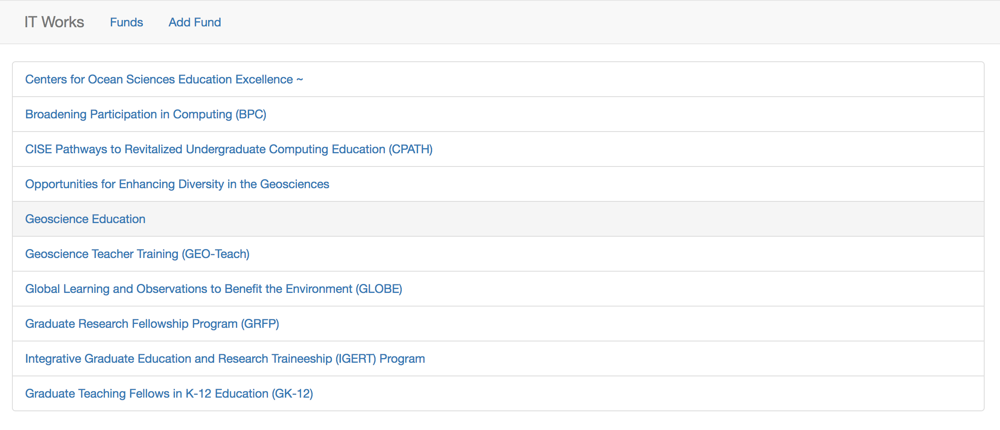

# It Works React

## Info

- Libraries Used: JavaScript, React, Bootstrap

- [x] Create a page with a listing of the funds
- [x] Create a Detail view which displays the detail of fund when clicked
- [x] Create "Add Fund” capabilities to allow the creation of a fund
- [x] Create "Update" capabilities to allow the update of the "Investment Name"
- [ ] Create a dynamic filter to reduce the amount of funds returned in the master list
- [x] Bonus - Create a notification which fires after 2 minutes to simulate STEM fund #2 has
been updated. The notification should send the user to the fund details screen for STEM fund
#2.

## Setup

To run locally `cd` into the application from your terminal and then run:

`yarn install` or `npm install`

Afterwards run the command:

`npm run dev` 

The application should now be running in your browser on `localhost:8080`.

## Teaser

## See it in DEV

To run locally in development mode run:

`npm run dev`

## See it in PROD

To run locally in production mode run:

`npm run serve:prod`

## See it LIVE

To see it live go to:

[https://it-works-react.now.sh/](https://it-works-react.now.sh/)
